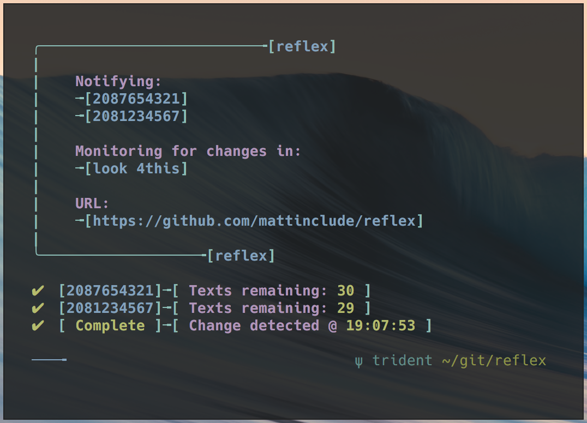

## reflex

reflex is a menu driven tool for monitoring changes on a web page. The script is using curl and grep to confirm a phrase is present on the page you supply. If the specified string is not present, or has changed, the notification will be sent. You will be given the option to notify 2 phone numbers via SMS. A textbelt.com ID is required in order to send the texts. reflex will stop once the notification(s) have been sent. Run reflex in the background and logoff if needed.

#### Requirements

    bash

#### Installation

    chmod +x reflex.sh

#### Usage

    Usage: ./reflex.sh [--help|--version|--license|--about]

    [options]

            --help          Display this message.
            --version       Show version.
            --license       Show lisense information.
            --about         Learn how reflex works.

    [Run in backgroud]
            While reflex is running, do:
            CTRL+Z
            disown h
            bg 1

#### Questions
Contact me at [matt@brassey.io](mailto:matt@brassey.io) with any questions or comments.

#### License
`reflex` is published under the __CC0_1.0_Universal__ license.

> The Creative Commons CC0 Public Domain Dedication waives copyright interest in a work you've created and dedicates it to the world-wide public domain. Use CC0 to opt out of copyright entirely and ensure your work has the widest reach. As with the Unlicense and typical software licenses, CC0 disclaims warranties. CC0 is very similar to the Unlicense.