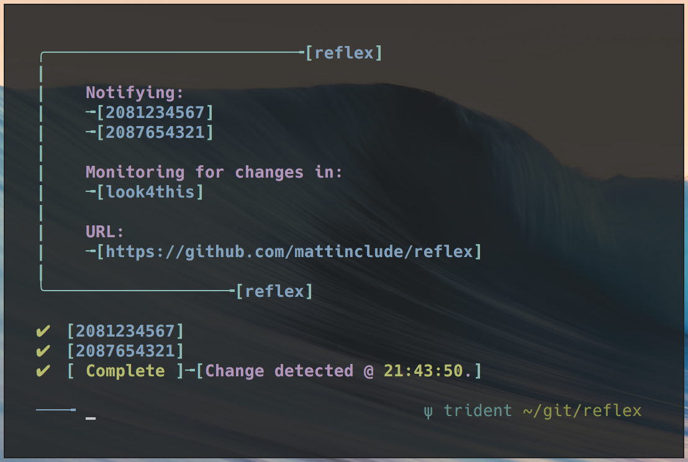

# reflex

> reflex v1.0.0 is a menu driven tool for monitoring changes on a web page.
> It uses curl and grep to confirm a phrase is present on the page you supply.
> If the phrase you specify is not present, or has changed, you will be notified.
> You will be given the option to notify 2 phone numbers via SMS. You will need a textbelt.com
> ID im order to send the texts. Reflex will stop once the notification(s) have been sent.
> You will have the option to run reflex in the background and logoff.

    Usage: ./reflex.sh [--help|--version|--license|--about]

    [options]

            --help          Display this message.
            --version       Show version.
            --license       Show lisense information.
            --about         Learn how reflex works.

    [Run in backgroud]
            While reflex is running, do:
            CTRL+Z
            disown h
            bg 1
